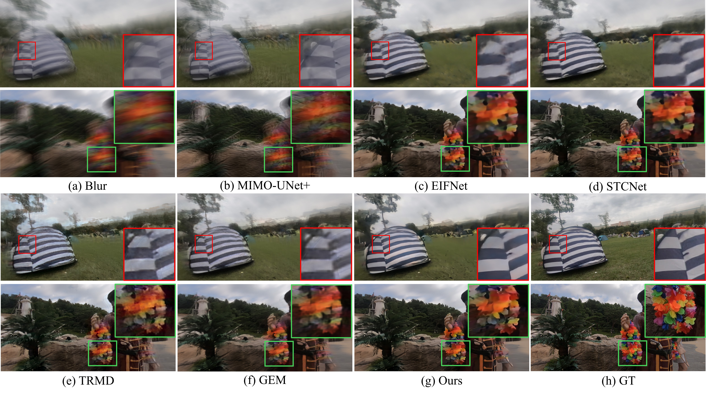
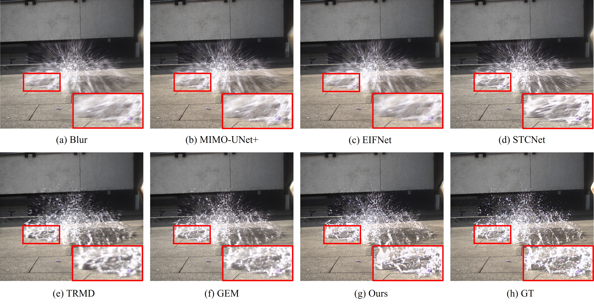
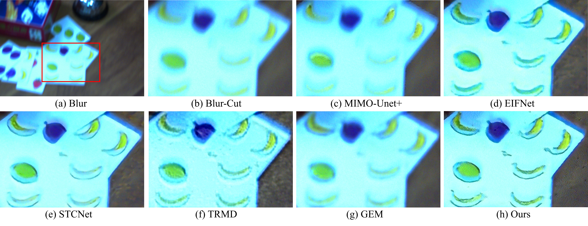
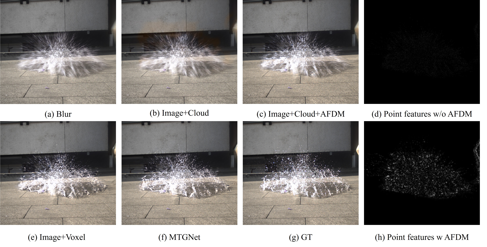
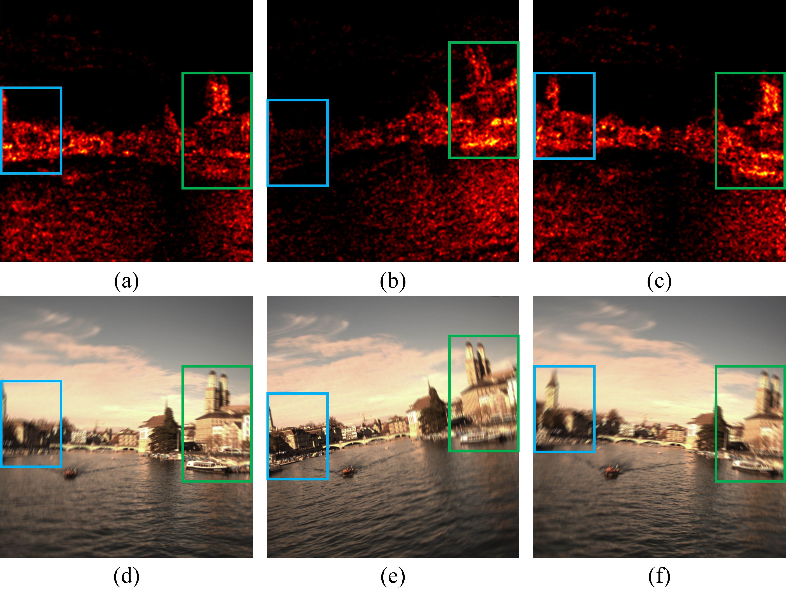

# Event-based Motion Deblurring via Multi-temporal Granularity Fusion

Official PyTorch implementation of Event-based Motion Deblurring via Multi-temporal Granularity Fusion, a framework designed for [event-based motion deblurring / event-frame enhancement / multi-modal reconstruction].

---

## 🛠️ Requirements

- Python >= 3.7
- PyTorch >= 1.12
- torchvision 0.13.0
- numpy 1.21.6
- opencv-python 4.10.0.84
- lpips 0.1.4

Install all dependencies:


```bash
pip install -r requirements.txt
```

## 📂 Datasets

We evaluate our method on the following datasets:

- **Ev-REDS** [Download Link](your_ev-reds_link)

Organize the datasets as:

```
datasets/
    ├── EV-REDS/
    ├── HS-ERGB/
    └── MS-RBD/
```

> Each dataset includes blurry RGB frames, ground truth sharp frames, and event data frames.

---

## 🔥 Pre-trained Models

Download the pre-trained models here:

- **Checkpoint for EV-REDS** [Download](your_evreds_checkpoint_link)

Place the downloaded `.pth` files into the `checkpoints/` directory:


---

## 🚀 Inference and Training

### Inference Example

```bash
python inference_MTGNet.py
```

### Training Example

```bash
python train_MTGNet.py
```
---

## 📈 Visualization

<details>
  <summary>🔹 EV-REDS Results</summary>

<br>

<p align="center">
  
</p>

</details>

---

<details>
  <summary>🔹 HS-ERGB Results</summary>

<br>

<p align="center">
  
</p>

</details>

---

<details>
  <summary>🔹 MS-RBD Results</summary>

<br>

<p align="center">
  
</p>

</details>
---

<details>
  <summary>🔹 Ablation Study Results</summary>

<br>

  


</details>
---

## 📜 Citation

If you find this work useful for your research, please consider citing:

```bibtex
@article{lin2024event,
  title={Event-based Motion Deblurring via Multi-Temporal Granularity Fusion},
  author={Lin, Xiaopeng and Ren, Hongwei and Huang, Yulong and Liu, Zunchang and Zhou, Yue and Fu, Haotian and Pan, Biao and Cheng, Bojun},
  journal={arXiv preprint arXiv:2412.11866},
  year={2024}
}
```

---

## 🙏 Acknowledgement

This work is developed based on [MIMO-UNet](https://github.com/chosj95/MIMO-UNet/).  
We sincerely thank the authors for their excellent open-source contribution.

---
